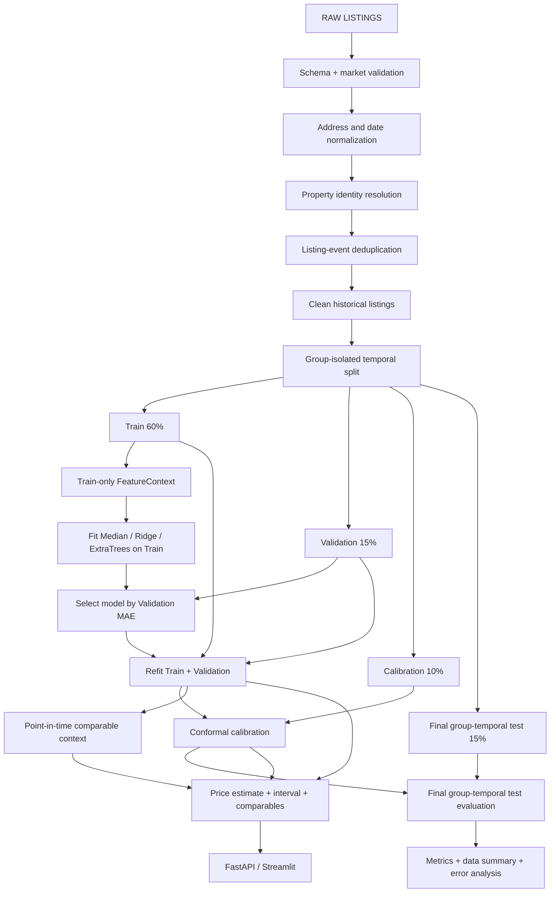
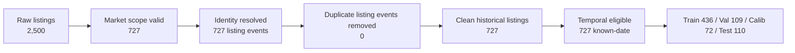

# HCMC Real Estate Price Intelligence

[](https://www.python.org/)
[](https://github.com/haminhthong/hcmc-real-estate-price-intelligence/actions/workflows/ci.yml)
[](https://scikit-learn.org/)
[](LICENSE)

Ước lượng **giá niêm yết tham khảo** cho nhà ở tại TP.HCM từ dữ liệu listing.
Kết quả gồm giá điểm, khoảng dự báo conformal, cảnh báo dữ liệu và các listing
tương đồng tồn tại trước thời điểm định giá. Đây là bài toán Data/ML có kiểm
soát leakage, không phải hệ thống thẩm định giá pháp lý hay nền tảng production
model registry.

README này là tài liệu hiện hành duy nhất. Cấu hình, code, artifact và báo cáo
đều phải bám theo một pipeline canonical bên dưới.

## Bài toán và phạm vi ứng dụng

Một căn nhà có thể xuất hiện nhiều lần:

```text
Listing A: 80 m², Quận 7, 6.8 tỷ, 01/03/2025
Listing B: 80 m², Quận 7, 6.95 tỷ, 15/04/2025
```

Hai dòng này không được xử lý bằng `drop_duplicates()` đơn giản. Project tách:

- `property_group_id`: nhóm nhận diện trong snapshot hiện tại, không phải ID toàn cục bền vững.
- `listing_event_id`: một lần rao cụ thể, giữ lại ngày và giá của lần rao đó.

Identity resolution dùng địa chỉ/khu vực, loại hình, diện tích, kết cấu và GPS
khi có. Chỉ strong match (địa chỉ có số nhà) hoặc cùng mã tin trong cùng nguồn được gộp;
medium/weak match chỉ gắn cờ `possible_duplicate`, không tự động merge. Sau đó deduplicate ở cấp
listing event để giữ lại các lần đăng lại hợp lệ.

Phạm vi model hiện hành:

| Hạng mục | Quy tắc |
| --- | --- |
| Thị trường | Các khu vực có trong dữ liệu train và `SUPPORTED_AREAS` |
| Loại hình | Các loại nhà ở xuất hiện trong dữ liệu train |
| Diện tích | `5–500 m²` |
| Giá mục tiêu | `100–50.000 triệu VND`, là giá niêm yết |
| Ngày | Dùng ngày cập nhật/listing; không tự gán ngày crawl giả |
| Missingness | Giữ bằng missing indicators trong feature contract |

Không dùng kết quả cho định giá pháp lý, thế chấp, tranh chấp tài sản hoặc quyết
định đầu tư tự động. Khoảng dự báo rộng là thông tin về độ bất định, không phải
lỗi cần che giấu bằng một nhãn “reliability” tự đặt.

## Luồng logic, luồng dữ liệu và pipeline duy nhất

Đây là quy trình chi phối toàn bộ code, artifact, API, Streamlit và báo cáo:



Điểm chính của project là **identity, deduplication, provenance và point-in-time
evaluation**. ExtraTrees chỉ là model được chọn trong một lần chạy; nó không phải
toàn bộ câu chuyện.

### Canonical split duy nhất

Code public chỉ có `split_group_indices()` trong
[`src/data/split.py`](src/data/split.py). Protocol hiện hành là:

```text
group_isolated_temporal_split_60_15_10_15_by_latest_property_date
```

Các `property_group_id` được sắp theo `listing_date` muộn nhất của từng group.
Toàn bộ listing của một group đi vào cùng một tập. Listing không có ngày bị loại
khỏi benchmark temporal, không bị gán một ngày giả. Vì group có thể chứa các
listing cũ hơn ngày muộn nhất, đây là **group-isolated temporal split**, không
phải strict row-level future holdout.

| Tập | Tỷ lệ | Vai trò |
| --- | ---: | --- |
| Train | 60% | Fit context, baseline và candidate models |
| Validation | 15% | Chọn model, không dùng Test |
| Calibration | 10% | Tính residual quantile cho conformal interval |
| Final Group-Temporal Test | 15% | Đánh giá generalization cuối cùng |

Model selection chạy theo đúng chuỗi:

```text
Train
  ↓
Naive Median / Segment Median / Ridge / ExtraTrees
  ↓
Validation: chọn champion
  ↓
Refit trên Train + Validation
  ↓
Calibration riêng
  ↓
Final Group-Temporal Test: report only
```

Test không được dùng để chọn model hoặc tune hyperparameter.

### Feature và model

`FeatureContext` chỉ được fit từ Train khi selection và từ Train + Validation khi
refit. Feature pipeline dùng chung cho train và serving, gồm:

- số: diện tích, phòng, tầng, kích thước, GPS, khoảng cách tới CBD và độ đầy đủ;
- phân loại: loại hình, khu vực, hướng và vị trí;
- text flags: nội thất, hẻm ô tô, gần chợ, gần trường, bán gấp;
- missing indicators cho GPS, kích thước, phòng, tầng, loại đường và hẻm;
- target log-space: `log1p(Price)` — tổng giá niêm yết, đơn vị triệu VND.

Ba ứng viên là Naive Median, Ridge và ExtraTrees. Segment Median chỉ là mốc
so sánh bổ sung, không tham gia chọn pipeline. Chọn theo MAE trên Validation.

### Conformal interval

Calibration dùng residual trên cùng không gian log với inference. Khi trả về
giá tiền, khoảng được ánh xạ ngược bằng `expm1`, vì vậy khoảng tiền có thể bất
đối xứng. Response có:

- `predicted_price_million`: point estimate;
- `prediction_interval`: cận dưới, cận trên và coverage mục tiêu 80%;
- `warnings`: miền input ngoài train, thiếu input/GPS, dữ liệu reference cũ hoặc
  khoảng quá rộng.

### Comparable listings

Comparable engine là **heuristic retrieval/evidence**, không phải estimator thứ
hai và không ensemble với model. Trọng số diện tích, GPS, phòng, CBD và recency
được cấu hình thủ công cho prototype; chúng không phải hệ số thẩm định được học.

Khi query tại thời điểm `t`, engine chỉ dùng listing có:

```text
listing_date <= t
```

và giới hạn ngữ cảnh trong 365 ngày gần nhất. Future listing và chính property
đang định giá không được dùng làm comparable.

## Data-quality funnel

Funnel hiện hành được ghi trong [`reports/data_summary.json`](reports/data_summary.json):



Diễn giải funnel:

- 2.500 dòng raw được nạp từ `data/sample/data_public_sample.csv`;
- 727 dòng nằm trong market scope sau schema, loại hình và numeric validation;
- 727 listing events được gán `property_group_id` sau identity resolution;
- 727 listing events còn lại sau dedup;
- 727 nhóm nhận diện cục bộ; không cặp nào đủ bằng chứng để tự động gộp;
- 0 listing events bị loại ở bước dedup với quy tắc hiện tại;
- 727 dòng có ngày và đủ điều kiện temporal benchmark.

Sample thiếu địa chỉ chi tiết nên số nhóm không phải số căn nhà thực tế đã xác
minh. Các ca strong match, source ID, medium/weak và đăng lại được kiểm thử bằng
dữ liệu giả có bằng chứng rõ ràng. Không suy ra chất lượng identity từ số nhóm.

## Data Card và metric hiện hành

Nguồn metric duy nhất là [`reports/metrics.json`](reports/metrics.json). Không
đưa metric cũ, metric notebook hoặc metric release folder vào README.

| Trường | Giá trị hiện hành |
| --- | ---: |
| Source | `data_public_sample.csv` |
| Snapshot date | `2025-05-03` đến `2025-09-30` |
| Raw listings | 2.500 |
| Valid listings | 727 |
| Clean listing events | 727 |
| Unique property groups | 727 (snapshot-local) |
| Known-date listings | 727 |
| Unknown-date listings | 0 |
| District coverage | 22 giá trị, gồm `Unknown` |
| Canonical split | 60 / 15 / 10 / 15 |

### Kết quả hiện hành trên Final Group-Temporal Test

Artifact hiện tại chọn `extra_trees` với target `total_price`:

| Metric | Giá trị |
| --- | ---: |
| Test samples | 110 |
| Test MAE | 4.928,7 triệu VND |
| Test WAPE | 45,52% |
| Test R² | 0,081 |
| Naive Median MAE | 6.332,0 triệu VND |
| Segment Median MAE | 6.068,2 triệu VND |
| Conformal target coverage | 80% |
| Test interval coverage | 72,73% |
| Mean interval width | 10.487,6 triệu VND |
| Relative interval width | 96,85% |

Các số liệu trên là báo cáo kết quả, không phải pass/fail release gate. Dataset
mẫu nhỏ và heterogeneous nên khoảng dự báo rộng; đây là limitation cần nói rõ
khi trình bày project.

## Ví dụ prediction

Ví dụ dưới đây dùng input `Nhà riêng`, `Quận 1`, `75 m²`, 3 phòng ngủ tại ngày
`2026-09-10`. Field `market_age_days` giúp người dùng thấy reference data đã cũ
bao lâu; `warnings` vẫn là cảnh báo cụ thể, không gom thành reliability score.
Response dưới đây rút gọn danh sách comparables còn một mục từ lần chạy hiện tại.

```json
{
  "predicted_price_million": 13338.1,
  "prediction_interval": {
    "lower_million": 6890.8,
    "upper_million": 25816.8,
    "coverage": 0.8
  },
  "comparables": [
    {
      "property_type": "Nhà riêng",
      "location_area": "Unknown",
      "area": 75.0,
      "price_million": 5000.0,
      "unit_price_million_m2": 66.7,
      "similarity_score": 0.71
    }
  ],
  "warnings": [
    "INPUT_OUTSIDE_TRAINING_RANGE: days_from_train_reference=345 nằm ngoài miền train [-149, 0].",
    "MISSING_GPS: Thiếu GPS nên comparable không dùng được khoảng cách địa lý.",
    "MISSING_INPUTS: Độ đầy đủ input chỉ đạt 10/100.",
    "STALE_MARKET_REFERENCE: Dữ liệu train cũ hơn 345 ngày.",
    "WIDE_PREDICTION_INTERVAL: Khoảng dự báo rộng 142%."
  ],
  "as_of_date": "2026-09-10",
  "market_reference_date": "2025-09-29",
  "market_age_days": 345,
  "model_version": "1.2.0",
  "top_contributions": [],
  "disclaimer": "Giá niêm yết tham khảo từ dữ liệu tin đăng, không phải giá giao dịch hoặc thẩm định pháp lý."
}
```

Response thực tế có thể thay đổi theo input và artifact được train gần nhất.
`top_contributions` chỉ có dữ liệu khi request bật `include_explanation`, mô hình
được chọn là mô hình cây và môi trường có SHAP. Trường hợp còn lại trả danh sách
rỗng; độ quan trọng toàn cục không thay thế giải thích từng dự báo.

## Cấu trúc thư mục

```text
hcmc-real-estate-price-intelligence/
├── api/
│   └── main.py                         # FastAPI: /health và /predict
├── app/
│   └── streamlit_app.py                # Demo định giá tương tác
├── data/sample/
│   └── data_public_sample.csv          # Dataset mẫu được phép theo dõi
├── src/
│   ├── data/
│   │   ├── loader.py                   # Nạp raw data
│   │   ├── schema.py                   # Schema contract
│   │   ├── validation.py                # Numeric/date validation
│   │   ├── cleaning.py                 # Data quality + listing dedup
│   │   ├── identity.py                 # Property identity resolution
│   │   └── split.py                    # Canonical group temporal split
│   ├── features/
│   │   ├── builder.py                  # Feature builder dùng chung
│   │   ├── context.py                  # Train-only FeatureContext
│   │   └── text.py                     # Text flags
│   ├── modeling/
│   │   ├── baselines.py
│   │   ├── candidates.py
│   │   ├── pipelines.py
│   │   ├── selector.py
│   │   └── trainer.py
│   ├── calibration/conformal.py        # Split conformal
│   ├── comparables/
│   │   ├── context.py
│   │   └── engine.py                   # Point-in-time evidence retrieval
│   ├── evaluation/
│   │   ├── metrics.py
│   │   ├── evaluator.py
│   │   └── report.py
│   ├── serving/
│   │   ├── predictor.py
│   │   ├── input_validation.py
│   │   └── explain.py
│   ├── artifacts/
│   │   ├── loader.py
│   │   └── writer.py
│   └── pipeline.py                     # Entry point duy nhất
├── artifacts/
│   ├── model.joblib
│   ├── feature_context.json
│   ├── calibration.json
│   └── comparables.csv
├── reports/
│   ├── metrics.json
│   ├── data_summary.json
│   └── error_analysis.json
├── notebooks/
├── tests/
├── .github/workflows/ci.yml
├── Dockerfile
├── requirements.txt
├── requirements-dev.txt
└── README.md
```

Không còn `models/v<version>`, `reference/v<version>`, production pointer,
candidate pointer, `artifacts/runs`, checksum runtime, release gate,
`src/reliability`, compatibility wrappers hoặc Docker Compose. Git history đủ để
theo dõi thay đổi code; artifact hiện tại có một nguồn sự thật phẳng.

## Cài đặt và chạy thử nghiệm

Yêu cầu Python 3.10 trở lên:

```powershell
python -m venv .venv
.\.venv\Scripts\Activate.ps1
python -m pip install --upgrade pip
python -m pip install -r requirements-dev.txt
```

### Kiểm tra code và test

```powershell
python -m pip check
python -m ruff check --no-cache api app src tests
python -m ruff format --check --no-cache api app src tests
python -m pytest -q -p no:cacheprovider
python -B -m src.evaluate
```

### Chạy pipeline canonical

Lệnh này dùng dataset mẫu mặc định và ghi đè **snapshot hiện hành** trong
`artifacts/` và `reports/`:

```powershell
python -B -m src.pipeline train
```

Hoặc chỉ rõ dữ liệu:

```powershell
python -B -m src.pipeline train --data-path data/sample/data_public_sample.csv
```

Không truyền `--version` và không tạo release folder. `MODEL_VERSION` trong
`src/config.py` chỉ là nhãn hiển thị của snapshot model, không phải production
pointer.

### Chạy API và Streamlit

Chạy từ thư mục gốc repo. Dùng `python -m streamlit` để Python nhận package local,
không sửa `sys.path` trong mã ứng dụng.

```powershell
uvicorn api.main:app --reload --port 8000
python -m streamlit run app/streamlit_app.py
```

- API docs: <http://127.0.0.1:8000/docs>
- API contract: `GET /health`, `POST /predict`
- Dashboard: <http://127.0.0.1:8501>

Ví dụ request:

```powershell
curl -X POST http://127.0.0.1:8000/predict `
  -H "Content-Type: application/json" `
  -d '{"Property Type":"Nhà riêng","location_area":"Quận 1","Area":75,"Bedrooms":3}'
```

### Docker

Dockerfile chạy API và kiểm tra artifact phẳng khi build:

```powershell
docker build -t hcmc-real-estate-price-intelligence .
docker run --rm -p 8000:8000 hcmc-real-estate-price-intelligence
```

Streamlit là demo local riêng và có thể chạy bằng lệnh `streamlit run` ở trên.

## CI

Workflow [`ci.yml`](.github/workflows/ci.yml) chạy trên push, pull request và
`workflow_dispatch`, gồm:

1. cài `requirements-dev.txt`;
2. `pip check`;
3. Ruff lint;
4. Ruff format check;
5. toàn bộ pytest;
6. đọc và kiểm tra `reports/metrics.json` bằng `src.evaluate`;
7. job `docker-smoke` build image, nạp artifact, đợi `/health` và gọi `/predict`.

Docker chỉ cài runtime từ `requirements.txt`. Test, Ruff và giao diện local nằm
trong `requirements-dev.txt`. `/health` trả 503 nếu không nạp được mô hình/context;
sau lần nạp đầu tiên, endpoint kiểm tra package đang được cache trong tiến trình.

CI không train lại, không promote model và không deploy. Vì artifact flat hiện
đang được lưu trong repo, bước test có thể chạy trực tiếp sau checkout.

## Giới hạn cần nói rõ

- Dữ liệu là asking price từ listing, không phải transaction price.
- Dataset mẫu chỉ có 727 listing events và 727 nhóm snapshot-local sau lọc.
- Thị trường heterogeneous nên Test R² thấp và conformal interval rộng.
- Comparable weights là heuristic thủ công; chưa phải appraisal coefficients.
- Identity resolution bảo thủ: medium/weak match chỉ cảnh báo, có thể bỏ sót một số merge.
- Strong matching vẫn dùng Union-Find nên có thể gộp bắc cầu; đây là heuristic,
  chưa được đo precision/recall trên dữ liệu identity có nhãn.
- Kết quả chỉ có ý nghĩa trong market scope và miền dữ liệu đã train.

## Tệp tham chiếu quan trọng

- [Canonical pipeline](src/pipeline.py)
- [Data cleaning và listing dedup](src/data/cleaning.py)
- [Property identity resolution](src/data/identity.py)
- [Canonical temporal split](src/data/split.py)
- [Feature contract](src/features/context.py)
- [Conformal calibration](src/calibration/conformal.py)
- [Comparable retrieval](src/comparables/engine.py)
- [Serving predictor](src/serving/predictor.py)
- [Current metrics](reports/metrics.json)
- [Current data summary](reports/data_summary.json)
