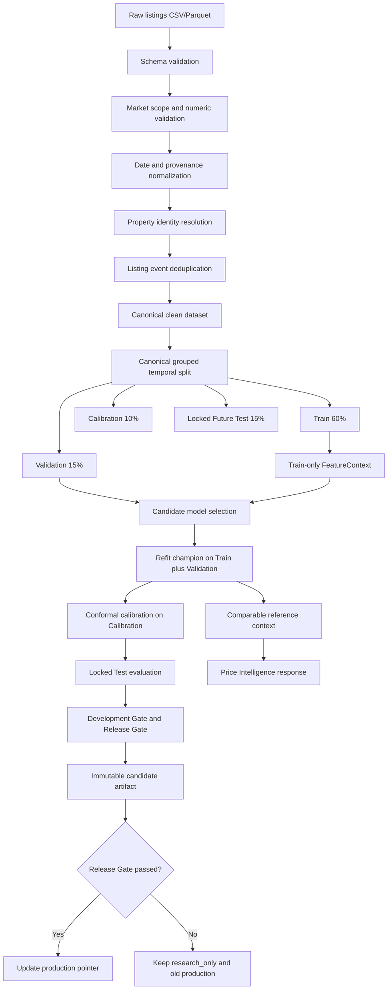
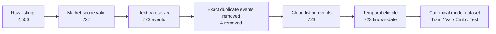

# HCMC Real Estate Price Intelligence

[](https://www.python.org/)
[](https://github.com/haminhthong/hcmc-real-estate-price-intelligence/actions/workflows/ci.yml)
[](https://pandas.pydata.org/)
[](https://fastapi.tiangolo.com/)
[](https://streamlit.io/)
[](https://scikit-learn.org/)
[](https://docs.pytest.org/)
[](https://docs.astral.sh/ruff/)
[](https://www.docker.com/)
[](LICENSE)

Hệ thống ước lượng **giá niêm yết tham khảo** cho bất động sản nhà ở tại
TP.HCM. Kết quả là giá chào bán dự kiến từ dữ liệu tin đăng, không phải giá
giao dịch thực tế, thẩm định pháp lý, tư vấn tín dụng hoặc khuyến nghị đầu tư.

README này là tài liệu hiện hành duy nhất của dự án. Các tài liệu snapshot cũ
đã được loại bỏ để tránh tạo nhiều contract cạnh tranh.

## 1. Bài toán và phạm vi ứng dụng

### Bài toán

Từ dữ liệu tin đăng bất động sản, hệ thống cần:

- Chuẩn hóa schema, provenance, ngày đăng và phạm vi thị trường.
- Nhận diện cùng một bất động sản nhưng vẫn giữ lại các lần đăng lại hợp lệ.
- Đánh giá mô hình theo thời gian, không để cùng một bất động sản xuất hiện ở
  nhiều tập dữ liệu.
- Trả về giá điểm, khoảng dự báo conformal, comparables và mức độ tin cậy.
- Lưu artifact có version, checksum và trạng thái release rõ ràng.

### Phạm vi hiện tại

| Hạng mục | Contract |
| --- | --- |
| Khu vực | Các quận/huyện nằm trong `SUPPORTED_AREAS` của [`src/config.py`](src/config.py) |
| Loại hình | Các loại nhà ở nằm trong `RESIDENTIAL_TYPES` |
| Diện tích | `5–500 m²` |
| Giá mục tiêu | `100–50.000 triệu VND` theo giá niêm yết |
| Target canonical | `log1p(Price)` trên tổng giá niêm yết |
| Ngày thiếu | Không tự gán ngày crawl; dòng không có ngày bị loại khỏi temporal benchmark |
| Missingness | Được giữ thành các feature indicator và dùng trong model |
| Trạng thái release hiện tại | `research_only`; production pointer chỉ thay đổi khi Release Gate đạt |

Hệ thống không dùng cho định giá pháp lý, thế chấp, tranh chấp tài sản hoặc
quyết định đầu tư tự động.

## 2. Luồng dữ liệu và luồng kỹ thuật canonical

Điểm cốt lõi của dự án là **identity + deduplication + provenance +
point-in-time evaluation**. ExtraTrees chỉ là một thành phần trong toàn bộ
chuỗi kiểm soát dữ liệu.



### Canonical split duy nhất

Protocol được `src/pipeline.py` chạy mặc định là:

```text
grouped_temporal_split_60_15_10_15_by_latest_group_listing_date
```

| Tập | Tỷ lệ | Mục đích | Quyền sử dụng |
| --- | ---: | --- | --- |
| Train | 60% | Fit feature context, candidate models và baseline | Được train |
| Validation | 15% | Chọn champion và target formulation | Chỉ dùng cho Development Gate |
| Calibration | 10% | Tính residual quantile conformal | Không dùng chọn model |
| Locked Future Test | 15% | Đánh giá release độc lập cuối cùng | Không quay ngược để tune model |

Các group được sắp theo ngày listing muộn nhất. Toàn bộ listing của cùng một
`property_group_id` đi vào cùng một split. Ngày unknown không bị coi là ngày
mới nhất.

`split_canonical_temporal_purged()` trong [`src/data/split.py`](src/data/split.py)
là **alternative experiment** 70/10/20 (Development/Calibration/Locked Future
Test), không phải protocol mà master pipeline đang chạy. Nó được giữ để so
sánh nghiên cứu, không được gọi là canonical trong báo cáo release.

### Chi tiết identity và listing event

- `property_group_id`: identity vật lý của bất động sản.
- `listing_event_id`: một lần rao cụ thể.
- `strong`: source/listing ID hoặc match địa chỉ, loại hình, diện tích và GPS
  với điều kiện chặt.
- `medium`: match bảo thủ theo area/ward/street, loại hình, diện tích và kết
  cấu khi thiếu GPS.
- `weak`: chỉ ghi `possible_duplicate=true`, không tự động union.
- Cùng nhà đăng lại ở ngày hoặc giá khác nhau vẫn được giữ lại để không làm mất
  tín hiệu thời gian.

### Feature và model contract

Training và serving đều dùng [`build_features()`](src/features/builder.py) với
`FeatureContext` đã đóng băng:

- số: diện tích, phòng, tầng, kích thước, GPS, khoảng cách CBD, độ đầy đủ;
- phân loại: loại hình, khu vực, hướng, vị trí;
- text flags: nội thất, hẻm xe hơi, gần chợ, gần trường, bán gấp;
- missingness indicators: GPS, kích thước, phòng, tầng, loại đường và hẻm;
- target canonical: `log1p(total_price)`;
- candidate hiện tại: Naive median, Ridge và ExtraTrees regularized.

Comparables là **evidence**, không phải estimator chính. Khi đánh giá offline,
comparables chỉ được lấy từ Train và phải có listing date không muộn hơn ngày
định giá; khi serving, reference context được fit sau refit từ Train +
Validation.

## 3. Data-quality funnel



Funnel được sinh lại trong `data_card.json` của mỗi run qua trường
`data_quality_funnel`. Các con số trong sơ đồ là snapshot hiện hành của release
đang được trỏ bởi `models/production.json`, không phải dữ liệu cố định cho mọi
release sau này.

## 4. Data Card hiện hành

Nguồn duy nhất của metric release là
[`reports/releases/v1.2.0/metrics.json`](reports/releases/v1.2.0/metrics.json).
Data Card chi tiết được lưu ở [`artifacts/data_card.json`](artifacts/data_card.json)
và được ghi lại cho từng run.

| Trường | Giá trị hiện hành |
| --- | ---: |
| Snapshot | `data_public_sample.csv` |
| Raw listings | 2.500 |
| Market-scope valid | 727 |
| Clean listing events | 723 |
| Unique property groups | 707 |
| Known-date listings | 723 |
| Unknown-date listings | 0 |
| District/area coverage | 21 khu vực trong artifact hiện hành |
| Canonical split | 60 / 15 / 10 / 15 |
| Model status | `research_only` |

### Metric release hiện hành

| Metric | Giá trị |
| --- | ---: |
| Test MAE | 4.621,7 triệu VND |
| Test WAPE | 42,92% |
| Test R² | 0,134 |
| Conformal target coverage | 80% |
| Conformal test coverage | 84,40% |
| Relative interval width | 117,20% |
| Release decision | `research_only` |

README chỉ hiển thị metric của release hiện hành; các metric lịch sử nằm trong
artifact/run tương ứng, không được dùng thay cho release hiện tại.

## 5. Ví dụ response prediction

Ví dụ dưới đây minh họa contract response, không phải kết quả cố định cho mọi
input:

```json
{
  "predicted_price_million": 6850.0,
  "lower_bound_million": 4300.0,
  "upper_bound_million": 10800.0,
  "confidence": "medium",
  "model_version": "1.2.0",
  "model_status": "research_only",
  "valuation_as_of": "2026-09-08",
  "model_market_reference": "2025-09-30T18:27:00",
  "market_age_days": 343,
  "reliability_level": "medium",
  "warnings": ["STALE_MARKET_MODEL"],
  "valuation": {
    "point_estimate_million": 6850.0,
    "prediction_interval": {
      "lower_bound_million": 4300.0,
      "upper_bound_million": 10800.0,
      "target_coverage": 0.8
    }
  },
  "market_context": {
    "segment_median_unit_price_million_m2": 82.4,
    "comparable_median_price_million": 7200.0,
    "comparable_median_unit_price_million_m2": 86.0
  },
  "comparables": [],
  "disclaimer": "Giá tham khảo từ tin đăng, không phải giá giao dịch hoặc thẩm định pháp lý."
}
```

API endpoint:

- `GET /health`
- `GET /model-info`
- `POST /predict`
- `POST /explain`
- `GET /market/districts`

## 6. Cấu trúc thư mục dự án

```text
hcmc-real-estate-price-intelligence/
├── api/                         # FastAPI schemas và endpoints
├── app/                         # Streamlit UI
├── .github/workflows/ci.yml     # CI: Ruff, pytest, evaluation report
├── data/
│   └── sample/                  # Dataset mẫu dùng để chạy thử
├── models/
│   ├── v<version>/              # Bundle immutable: model, context, calibration
│   ├── production.json          # Pointer active production release
│   └── candidate.json           # Candidate release gần nhất
├── reference/v<version>/       # Comparables CSV/Parquet tách khỏi model
├── artifacts/
│   ├── runs/run_<timestamp>/    # Manifest, metrics, data card của từng run
│   └── *.json                   # Snapshot tương thích ngược
├── reports/
│   └── releases/v<version>/     # Metrics công bố cho từng release
├── src/
│   ├── data/                    # Loader, validation, identity, split, manifest
│   ├── features/                # Feature builder, context, text, temporal
│   ├── modeling/                # Candidate, selection, trainer, baseline
│   ├── calibration/             # Conformal calibration
│   ├── comparables/             # Comparable context và benchmark
│   ├── evaluation/              # Test metrics và báo cáo
│   ├── reliability/             # OOD, stale model, reliability guards
│   ├── serving/                 # Predictor, explain, serving comparables
│   ├── artifacts/               # Writer, loader, schema, governance
│   └── pipeline.py              # Master lifecycle pipeline
├── tests/                       # Unit, API, preprocessing, lifecycle tests
├── requirements.txt
├── requirements-dev.txt
├── Dockerfile
└── docker-compose.yml
```

## 7. Cài đặt và chạy thử nghiệm

### Cài đặt local

Yêu cầu Python 3.10 trở lên:

```powershell
python -m venv .venv
.\.venv\Scripts\Activate.ps1
python -m pip install --upgrade pip
pip install -r requirements-dev.txt
```

### Chạy test và lint

```powershell
python -m pytest -q -p no:cacheprovider
python -m ruff check --no-cache api app src
```

### Chạy canonical training pipeline

Không ghi đè version đã tồn tại. Hãy dùng version mới cho mỗi lần train:

```powershell
python -m src.pipeline train --data-path data/sample/data_public_sample.csv --version 1.3.0
```

Pipeline sẽ tạo:

- `models/v1.3.0/` immutable bundle;
- `reference/v1.3.0/` comparables reference;
- `artifacts/runs/run_<timestamp>/` audit snapshot;
- `reports/releases/v1.3.0/metrics.json` release metrics;
- `models/candidate.json`;
- chỉ cập nhật `models/production.json` nếu Release Gate đạt.

### Chạy API và giao diện

```powershell
uvicorn api.main:app --reload --port 8000
streamlit run app/streamlit_app.py
```

Swagger UI: <http://127.0.0.1:8000/docs>

### Chạy bằng Docker Compose

```powershell
docker compose up --build
```

- API: <http://127.0.0.1:8000/docs>
- Dashboard: <http://127.0.0.1:8501>

### CI

Workflow [`ci.yml`](.github/workflows/ci.yml) chạy trên mỗi push, pull request
hoặc có thể kích hoạt thủ công bằng `workflow_dispatch`. CI cài
`requirements-dev.txt`, chạy `pip check`, kiểm tra Ruff trên `api/app/src`,
chạy toàn bộ pytest và kiểm tra báo cáo evaluation đã lưu. CI không train lại
hoặc ghi đè artifact version đã tồn tại; việc train release được thực hiện
riêng qua canonical pipeline với version mới.

## 8. Governance và nguyên tắc an toàn

- Development Gate chỉ đọc Validation; Release Gate chỉ đọc Locked Future Test
  và Conformal Calibration.
- Không dùng Test để quay ngược tinh chỉnh hyperparameter.
- Bundle release đã tồn tại không được ghi đè.
- Loader production kiểm tra production pointer, file bắt buộc và SHA256; lỗi
  artifact thì fail-closed.
- `research_only` không được tự động thay thế production model hiện hành.
- Model cũ hơn 180 ngày so với `as_of_date` phát cảnh báo
  `STALE_MARKET_MODEL`.
- Comparables không được lấy từ tương lai so với thời điểm định giá.
- Dữ liệu không có ngày không được biến thành ngày crawl giả.

## 9. Tệp tham chiếu quan trọng

- [Canonical pipeline](src/pipeline.py)
- [Data cleaning và identity](src/data/cleaning.py)
- [Temporal split](src/data/split.py)
- [Feature contract](src/features/context.py)
- [Serving predictor](src/serving/predictor.py)
- [Artifact governance](src/artifacts/writer.py)
- [Current release metrics](reports/releases/v1.2.0/metrics.json)
